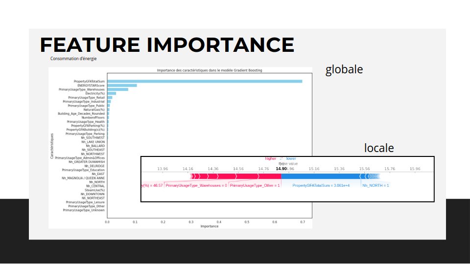

# Anticipation des Besoins en Consommation Énergétique des Bâtiments

  

## Contexte

Je travaille actuellement pour la ville de **Seattle** dans le cadre d'un projet visant à atteindre l'objectif de neutralité carbone d'ici 2050. Mon équipe se concentre sur la prédiction de la consommation énergétique et des émissions de CO2 des bâtiments non résidentiels, en se basant sur leurs caractéristiques structurelles. Ce projet implique également l'évaluation de l'intérêt de l'**ENERGY STAR Score** pour la prédiction des émissions, dans le but d'optimiser les calculs pour les bâtiments futurs.

## Objectif du Projet

L'objectif de ce projet est double :
1. Réaliser une analyse exploratoire des données de consommation énergétique des bâtiments non résidentiels.
2. Tester et comparer différents modèles de prédiction pour estimer les émissions de CO2 et la consommation totale d'énergie, en utilisant un ensemble de variables structurelles et l'**ENERGY STAR Score**.

## Étapes de l'Analyse

1. **Analyse Exploratoire** :
    - Étude initiale des données pour comprendre les distributions, identifier les variables importantes, et déceler les éventuelles anomalies.

2. **Feature Engineering** :
    - Sélection et transformation des variables pertinentes (catégorielles et numériques).
    - Création de nouvelles variables et normalisation des données pour améliorer les performances des modèles.
    
3. **Modélisation** :
    - Test de quatre algorithmes de machine learning différents (ElasticNet, SVM, GradientBoosting, RandomForest).
    - Optimisation des hyperparamètres et évaluation des modèles via validation croisée.
    - Comparaison des performances et sélection du modèle final.

4. **Évaluation de l'Importance des Variables** :
    - Analyse globale et locale de l'importance des variables pour comprendre leur influence sur les prédictions.

## Livrables

- **Notebook d'Analyse Exploratoire** : Documenté et annoté, ce notebook présente les étapes d'exploration initiale des données.
- **Notebooks de Prédiction** : Deux notebooks distincts, chacun consacré à la prédiction des émissions de CO2 et de la consommation totale d'énergie, avec les résultats des différents modèles testés et le modèle final choisi.
- **Support de Présentation** : Une présentation de 15 à 25 slides, préparée pour la soutenance, couvrant l'analyse exploratoire, le feature engineering, la modélisation et les résultats finaux.

## Soutenance

La soutenance repose sur votre présentation, qui couvre les aspects suivants :
- Rappel de la problématique et présentation du jeu de données.
- Présentation du feature engineering.
- Explication de l'approche de modélisation et présentation des résultats.
- Discussion autour des choix méthodologiques et des résultats.

### Visionner la Soutenance

Vous pouvez visionner l'enregistrement de la soutenance à l'adresse suivante : [Lien vers la vidéo](https://youtu.be/3VZpQevh_yI?si=o02yuLIAUgPwzybh).

## Contact

Pour plus d'informations sur moi ou pour accéder à mes coordonnées, veuillez visiter mon site web : [alexandre.rogues.fr](https://alexandre.rogues.fr).

Merci de l'intérêt que vous portez à ce projet !

